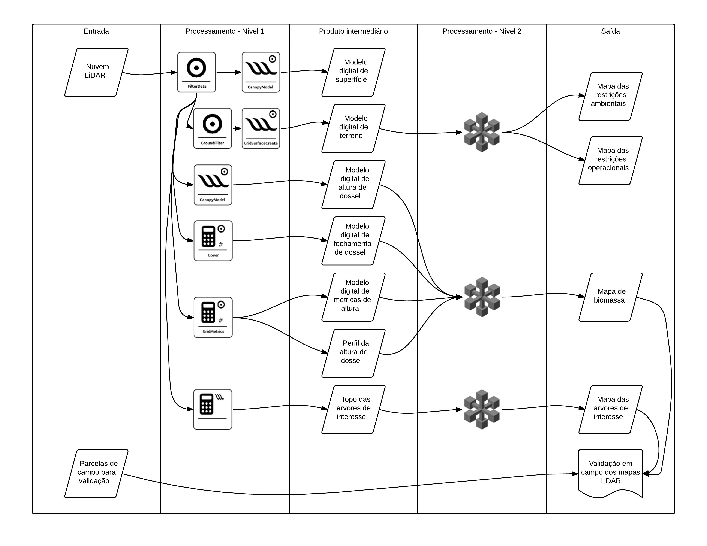
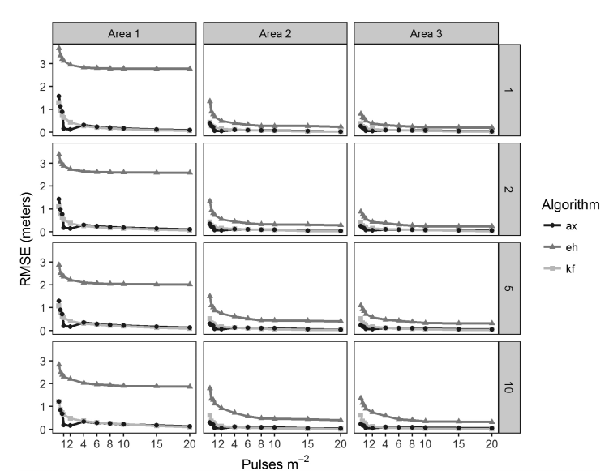
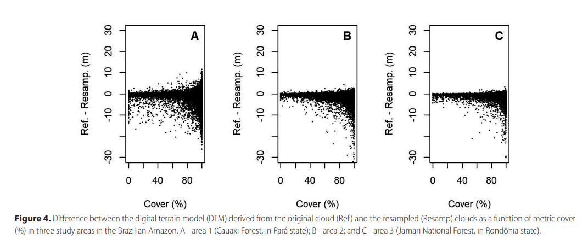
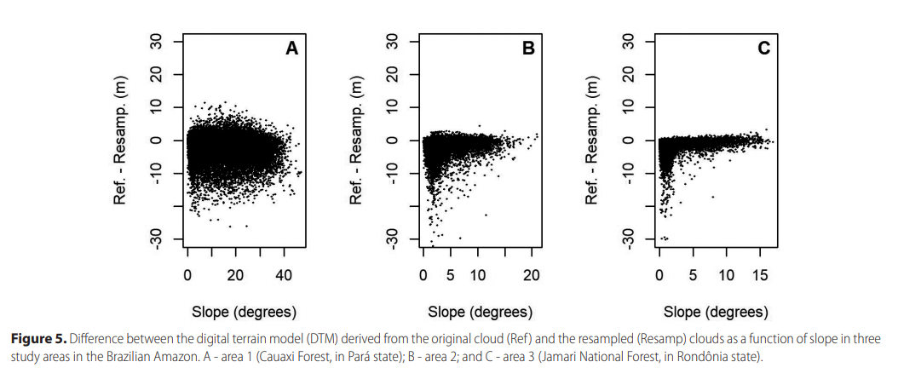
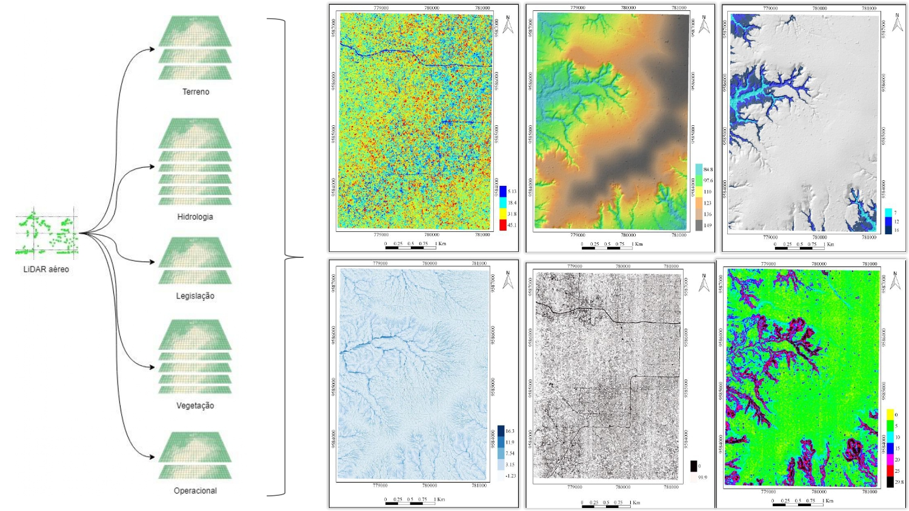

Coordenador: Eric Bastos Gorgens (UFVJM)

## Resumos dos resultados

1. Parâmetros para criação do modelo digital de terreno para floresta tropical

ANDRADE, Mariana Silva et al. Airborne laser scanning for terrain modeling in the Amazon forest. Acta Amazonica, v. 48, n. 4, p. 271-279, 2018.

2. Rede de drenagem e das áreas com limitações operacionais e ambientais relacionadasao terreno

3. Estimar de forma espacialmente explícita a biomassa

4. Potencial produtivo daunidade de manejo
