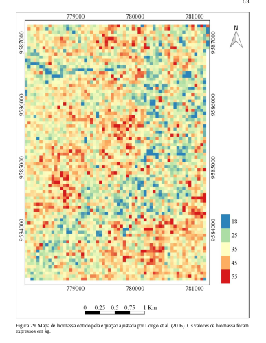
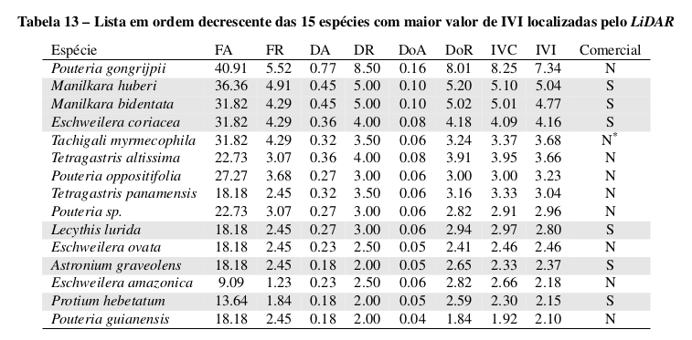
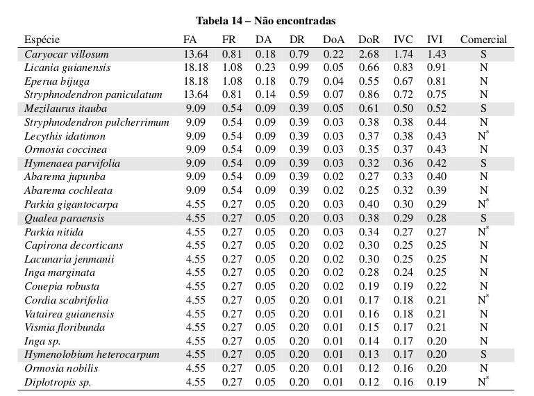
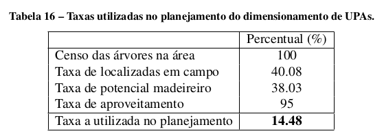

# Mapeamento de restrições operacionais, das restrições ambientais e do potencial madeireiro em floresta tropical

Coordenador: Eric Bastos Gorgens (UFVJM)

O projeto foi construído para contribuir com o avanço da arte na área do conhecimento com cincometas. A primeira meta contribiu com a proposição e validação de parâmetros para criação do modelodigital terreno em áreas de floresta ombrófila. Os resultados mostram que modelos digitais de terrenoconfiáveis podem ser gerados com núvel LiDAR a partir de 2 retornos por metro quadrado, e queexiste um balanço entre densidade de retornos e precisão que pode ser administrado pelo pesquisadorna geração de produtos.  A segunda meta permitiu a criação de uma rotina computacional semi-automatizada, que está disponível de forma aberta no Github do pesquisador, para determinar as áreasde limitação ambiental e operacional. Como demonstrado nos trabalhos desenvolvidos, essas limitaçõesestão geralmente associadas à rede de drenagem e áreas de alta declividade. A terceira meta permitiuestimar a biomassa a partir de métricas estruturais derivados da nuvem LiDAR, utilizando equaçõesajustadas para a região amazônica. A meta quatro está relacionada com a meta 3, mas foi orientadanuma perpectiva de indivíduos potenciais.  A abordagem proposta estimou o potencial produtivopor meio dos indivíduos dominantes identificados pelo LiDAR, gerando um mapa de localização comum percentual considerável dos indivíduos de interesse ao manejo. A meta 5 permitiu consolidar aparceria com três importantes centros internacionais, além de solidificar as parcerias nacionais em queo pesqusiador ser insere. Um desdobramento inesperado do projeto, foi que durante o desenvolvimentoe testes da metodologia para a localização de indivíduos emergentes, árvores gigantes foram localizadasna Amazônia, feito inédito que reabriu discussões ecológicas sobre as florestas brasileiras.

## Resumos dos resultados

- Parâmetros para criação do modelo digital de terreno para floresta tropical

ANDRADE, Mariana Silva et al. Airborne laser scanning for terrain modeling in the Amazon forest. Acta Amazonica, v. 48, n. 4, p. 271-279, 2018.

- Rede de drenagem e das áreas com limitações operacionais e ambientais relacionadasao terreno

- Estimar de forma espacialmente explícita a biomassa

- Potencial produtivo da unidade de manejo

- Monitoramento da vegetação

[Inlcuir artigo Southern Forests)
